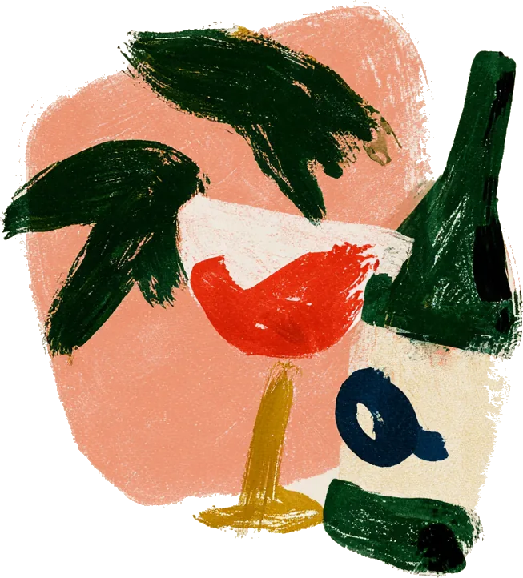
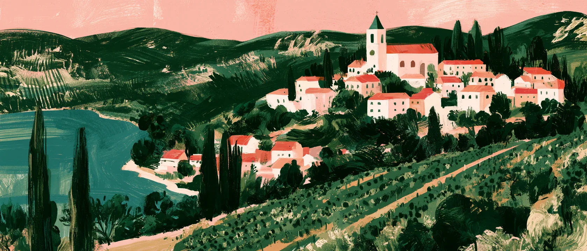

<p align="center">
  
</p>

<h1 align="center">Veloria Estate Winery</h1>

A site for a winery that does not exist, built as a portfolio piece. Veloria
is a fictional estate in the hills south of Siena. The brief it is built
against is in `CLAUDE.md`.

Fifteen prerendered pages and no backend. Nothing transacts: no cart, no
checkout, no form that submits. Every call to action links to the contacts
page.

## Stack

Next.js 16 with the App Router, React 19, Tailwind 4 and TypeScript. Jost is
the only typeface. Images were re-encoded with sharp, the one video with
ffmpeg.

```bash
npm install
npm run dev     # http://localhost:3000
npm run build
```

## Pages

| Route | |
|---|---|
| `/` | hero, wines, vineyards, family, visit |
| `/about` | the founding, the name, the family |
| `/wines`, `/wines/[slug]` | the four wines, and one page each |
| `/family/[slug]` | one page for each of the four Bellandi |
| `/vineyards` | the land and the painted map |
| `/visit` | the tasting room, on a looping video |
| `/contacts` | address, email, telephone |

## How it is put together

`src/data/` holds every fact the site states: prices, vintages, hectares,
dates, names. Nothing is retyped into a component, so two pages cannot end up
disagreeing about the same number.

The interface is built out of hand-painted illustrations, and every colour is
sampled from the artwork rather than picked next to it. Seven tokens in
`globals.css`, no hex values in components, and no grey, black or white used
as a surface.

Motion is one thing only: elements fade up sixteen pixels the first time they
come into view, and never again. No parallax and no scroll effects. Reduced
motion skips it, and the page still reads with JavaScript off.

`scripts/check-seams.mjs` checks every image the site renders for the one
mistake that kept coming back: a painting whose own paper is close to the page
cream but not equal to it, which leaves a visible edge.

## Before editing images

The dev image optimiser caches by URL, not by file contents. Replace a file in
`public/images/` without renaming it and the server keeps serving the old copy
at the old size until you clear `.next/dev/cache/images`. Refreshing the
browser will not help.

<p align="center">
  
</p>
