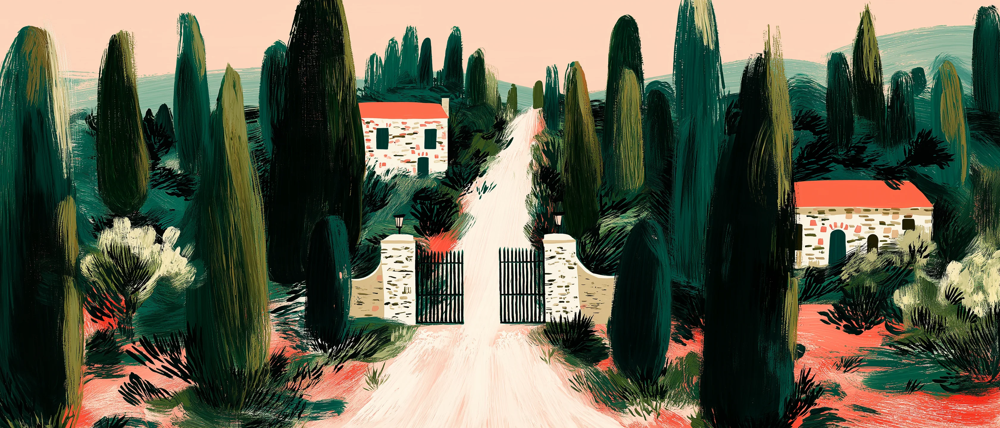
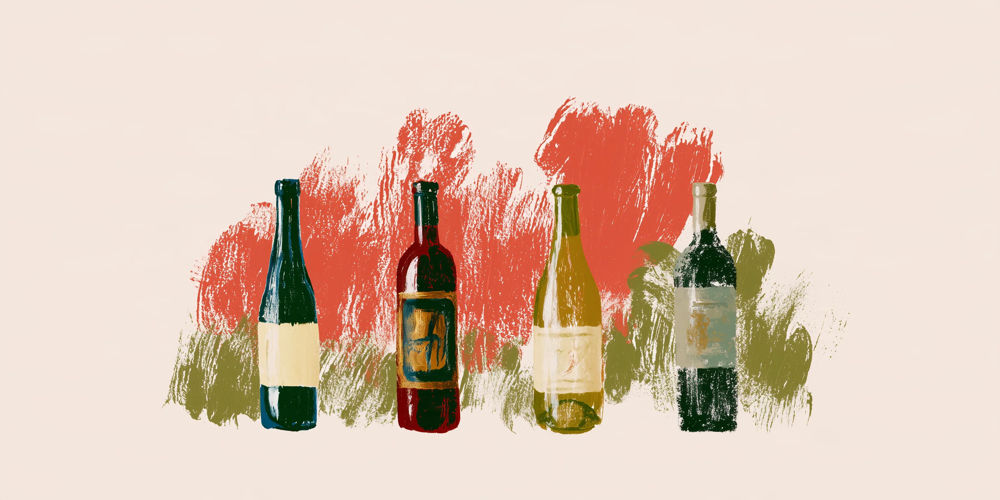
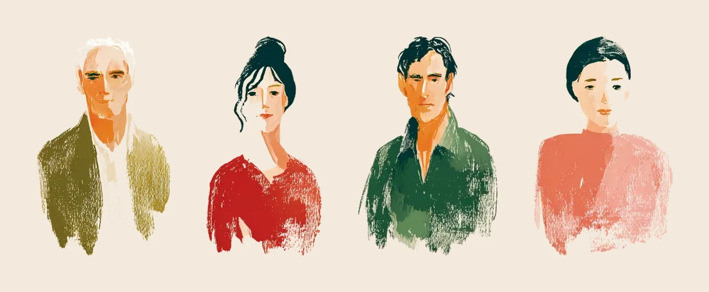

<p align="center">
  
</p>

<h1 align="center">Veloria Estate Winery</h1>

<p align="center">
  
</p>

A winery that does not exist, built as a portfolio piece.

Veloria sits in the hills south of Siena and was founded in 1978 by a family
called Bellandi. None of that is true, but all of it is written down: the four
wines, the dates, the hectares, the people and the way they are allowed to be
described live in `CLAUDE.md`, and the site is not allowed to disagree with it.

Fifteen prerendered pages and nothing behind them. No cart, no checkout, no
booking form. Every call to action goes to the contacts page and asks you to
write, which is what a small estate would actually make you do.

## The look

The interface is built out of hand-painted gouache illustrations, and every
colour on the page is sampled from the artwork rather than chosen next to it.
That is the whole trick: the type and the paintings end up on the same sheet
of paper.

| Token | | Where it came from |
|---|---|---|
| `--paper` | `#f4eadd` | the cream the illustrations are painted on |
| `--ink` | `#23331f` | the darkest foliage |
| `--ink-soft` | `#74553f` | the brown the lettering was drawn in |
| `--vermilion` | `#d4402a` | the red dress, the ripe grapes |
| `--indigo` | `#1b3a6b` | the roof |
| `--olive` | `#9a8a33` | the hill |
| `--vine` | `#cfe3a6` | the sunlit side of a vine leaf |

No hex values anywhere in a component, and no grey, black or white used as a
surface. Type is Jost and only Jost: tracked capitals for labels, light weights
at large sizes for anything that needs to be read slowly.

Motion is one primitive. `<Reveal>` fades an element up sixteen pixels the
first time it enters the viewport and never again. No parallax and no scroll
effects. Under `prefers-reduced-motion` it shows everything immediately, and a
`<noscript>` rule keeps the page readable with JavaScript switched off.

## Four wines, and no plans for a fifth

<p align="center">
  
</p>

Each one has a page of its own, and so does each of the four people who turn up
on it. Neither set has a dead end: the wines and the family both read as a ring,
so there is always one either side of the one you are looking at.

<p align="center">
  
</p>

## Running it

```bash
npm install
npm run dev
```

## How it is put together

`src/data/` holds every fact the site states: the wines with their prices and
vintages, the estate figures, the family. Nothing is retyped into a component,
so a page and a section cannot drift apart.

`src/components/` holds the pieces shared across routes, including the header,
the footer, the reveal, and the block that ends every page and points at two
others.

`scripts/check-seams.mjs` walks every image the site renders and measures the
outer frame of each one against the page cream. A painting whose own paper is
close to the background but not equal to it leaves a visible step, and that
fault kept coming back, so now it fails a check instead.

## Two things that cost me an afternoon each

Next's development image optimiser caches by URL rather than by file contents.
Replace a file in `public/images/` without renaming it and the dev server keeps
serving the old optimised copy, at the old dimensions, until you clear
`.next/dev/cache/images`. A hard refresh in the browser will not help, because
the stale copy is on the server.

The illustrations were each painted on a separate sheet and none of those
creams is exactly the page's cream. A full-frame painting dropped onto the
background as a floating rectangle will always show its edge. Either bleed it
to the full width so only the top and bottom meet the page, or key the paper
out and let the motif stand on the cream.

<p align="center">
  
</p>

## Stack

Next.js 16 with the App Router, React 19, Tailwind 4, TypeScript. The images
were re-encoded with sharp, the one piece of video with ffmpeg.
